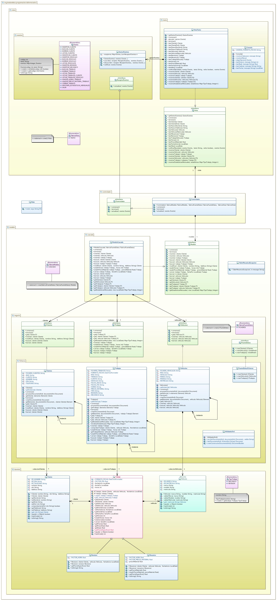

# Tarea: Taller mecánico
## Profesor: José Ramón Jiménez Reyes
## Alumno:

Al cliente le ha gustado bastante la aplicación, pero nos comenta algunas mejoras que necesita la anterior versión y nuevas funcionalidades que le gustaría que tuviese. Todo ello lo abordaremos en este **tercer sprint**.

Nos comenta que necesita que añadamos persistencia de datos, ya que tal y como está ahora la aplicación no es funcional. 

También nos comenta que le gustaría que los listados se mostrasen ordenados de la siguiente forma:
- **Clientes**: Ordenados por nombre y DNI.
- **Vehículos**: Ordenados por marca, modelo y matrícula.
- **Trabajos**: Ordenados por fecha de inicio y por cliente (nombre y DNI).

También nos comenta que le gustaría poder mostrar estadísticas mensuales indicando el número de tipos de trabajos realizados en dicho més.

Por tanto, en este **tercer sprint** añadiremos **persistencia** a los datos utilizando para ello **ficheros XML**, para lo que sustituiremos el modelo que teníamos de memoria, por un modelo de ficheros. **Ordenaremos los listados** al mostrarlos y permitiremos mostrar **estadísticas mensuales por tipo de vehículo**.

Al **analizar** cómo llevaremos a cabo la **persistencia**, hemos decidido leer los ficheros al arrancar la aplicación, gestionarlos en memoria y almacenarlos en los mismos ficheros al cerrar la aplicación. Cada clase de la implementación de la capa ficheros leerá su fichero y lo almacenará en una lista tal y como se hacía en la versión de memoria. Pero con esto nos surge algún que otro problema:
- Los trabajos guardan una referencia del cliente y del vehículo, pero dicha clase no es capaz de comunicarse con las otras para poder buscar dichas referencias. Para solucionar este problema vamos a utilizar el **patrón singlenton**, con lo que solo podremos tener una única instancia de cada clase de la capa de ficheros. Con esto
conseguimos que no haya más de una instancia que pueda leer el fichero y posteriormente modificarlo, por lo que podremos acceder sin problemas desde los trabajos a los clientes y a los vehículos para buscar las referencias.
- Pero esto acarrea otro problema y es que estamos exponiendo dichas instancias a toda la aplicación, lo que podría permitir que desde cualquier lugar se pueda acceder a las mismas provocando efectos indeseados y rompiendo con el principio de ocultación de la información. Para solucionarlo jugaremos con las visibilidades. Haremos que los métodos que nos devuelven la instancia de cada clase (`getInstancia`) tengan una **visibilidad de paquete**, con lo que solo podremos acceder a ellas desde el paquete ficheros. También tenemos que hacer que la factoría de fuente de datos solo permita crearlas desde el mismo paquete para que solo se puedan crear
fuentes de datos desde la capa de modelo. 

En este repositorio hay un esqueleto de proyecto **gradle** con las dependencias necesarias del proyecto y que, en la rama `ficherosXML`, ya lleva incluidos todos los test necesarios que el modelo debe pasar, con todo lo que hemos comentado.

Para ello te muestro un diagrama de clases (en el que cuando se expresa cardinalidad `*` queremos expresar que se hará uso de **listas**) para el mismo y poco a poco te iré explicando los diferentes pasos a realizar:

#### Primeros Pasos
1. Lo primero que debes hacer es mezclar tu rama `refactorizacion_herencia` con la rama `master` y crear un nueva rama etiquetada como `ficheros` a partir de ella.
2. Añade el remote de mi repositorio (si aún no lo tenías añadido) y haz un `pull` del mismo de la rama `master`.
3. Cámbiate a la rama `ficheros` y haz otro pull de mi remote de la misma rama.
4. Modifica el archivo `README.md` para que incluya tu nombre en el apartado "Alumno".
5. Haz que al controlador se le pasen las distintas fábricas (modelo, fuente de datos y vista) y sea él el que cree los objetos. Realiza tu **primer commit**.

#### Generación de las estadísticas
1. Crea el enumerado `TipoTrabajo` tal y como se indica en el diagrama de clases.
2. Añade el método `getEstadisticasMensuales`a la clase `Trabajos` e impleméntalo adecuadamente (utiliza el método `inicializarEstadisticas` para hacerlo más sencillo).
3. Añádelos a la interfaz `ITrabajos`, al modelo y a la interfaz del modelo.
4. Añade un nuevo evento para permitir ejecutar esta opción.
5. Añade a la vista el método para leer el mes y también a la interfaz.
6. Añade a la vista el método para mostrar las estadísticas y también a la interfaz.
7. Haz que el controlador tenga en cuenta este evento y actúe en ctmecuencia. Realiza un **commit**.

#### Ordenación de los listados
1. Haz que a la hora de mostrar los clientes se muestren ordenados tal y como indica el enunciado.
2. Haz lo mismo para los vehículos.
3. Haz lo mismo para los trabajos. Realiza un **commit**.

#### Persistencia en ficheros XML
1. Refactoriza la fuente de datos `MEMORIA` para que pase a llamarse `FICHEROS` (refactoriza lo que creas necesario también).
2. Añade los métodos `comenzar` y `terminar` en las interfaces de la fuente de datos.
3. Implementa el **patrón Singleton** en las clases `Clientes`, `Vehiculos` y `Trabajos`.
4. Implementa los métodos `comenzar` y `terminar` para la clase `Clientes` del paquete `ficheros` para que al comenzar lea el fichero XML de vehículos, lo almacene en una lista y al terminar lo vuelva a almacenar en dicho fichero. El fichero se debe llamar `clientes.xml` y debes utilizar **rutas relativas** para trabajar con él. Debes implementar los métodos que se especifican en el diagrama y que son autoexplicativos. La estructura del fichero será la siguiente:
    ~~~xml
    <?xml version="1.0" encoding="UTF-8" standalone="no"?>
    <clientes>
        <cliente dni="11223344B" nombre="Bob Esponja" telefono="950112233"/>
        <cliente dni="11111111H" nombre="Patricio Estrella" telefono="950111111"/>
    </clientes>
    ~~~
5. Implementa los métodos `comenzar` y `terminar` para la clase `Vehiculos` del paquete `ficheros` para que al comenzar lea el fichero XML de vehículos, lo almacene en una lista y al terminar lo vuelva a almacenar en dicho fichero. El fichero se debe llamar `vehiculos.xml` y debes utilizar **rutas relativas** para trabajar con él. Debes implementar los métodos que se especifican en el diagrama y que son autoexplicativos. La estructura del fichero será la siguiente:
    ~~~xml
    <?xml version="1.0" encoding="UTF-8" standalone="no"?>
    <vehiculos>
        <vehiculo marca="Scania" matricula="1234BCD" modelo="Citywide"/>
        <vehiculo marca="Seat" matricula="1111BBB" modelo="León"/>
        <vehiculo marca="Renault" matricula="2222CCC" modelo="Megane"/>
        <vehiculo marca="Mercedes-Benz" matricula="3333DDD" modelo="eSprinter"/>
    </vehiculos>
    ~~~
6. Implementa los métodos `comenzar` y `terminar` para la clase `Trabajos` del paquete `ficheros` para que al comenzar lea el fichero XML de vehículos, lo almacene en una lista y al terminar lo vuelva a almacenar en dicho fichero. El fichero se debe llamar `trabajos.xml` y debes utilizar **rutas relativas** para trabajar con él. Debes implementar los métodos que se especifican en el diagrama y que son autoexplicativos. La estructura del fichero será la siguiente:
    ~~~xml
    <?xml version="1.0" encoding="UTF-8" standalone="no"?>
    <trabajos>
        <trabajo cliente="11223344B" fechaFin="07/03/2024" fechaInicio="01/03/2024" horas="10" tipo="revision" vehiculo="3333DDD"/>
        <trabajo cliente="11111111H" fechaFin="14/03/2024" fechaInicio="10/03/2024" tipo="revision" vehiculo="1111BBB"/>
        <trabajo cliente="11223344B" fechaFin="16/03/2024" fechaInicio="10/03/2024" horas="5" tipo="mecanico" vehiculo="1234BCD"/>
        <trabajo cliente="11111111H" fechaInicio="15/03/2024" precioMaterial="125.500000" tipo="mecanico" vehiculo="2222CCC"/>
    </trabajos>
    ~~~
7. Comprueba que todo funciona correctamente y que pasa todos los test. Realiza un **commit** y seguidamente realiza el **push** a tu repositorio remoto.

#### Se valorará:

- La indentación debe ser correcta en cada uno de los apartados.
- Los identificadores utilizados deben ser adecuados y descriptivos.
- Se debe utilizar la clase `Entrada` para realizar la entrada por teclado que se encuentra como dependencia de nuestro proyecto en la librería entrada.
- El programa debe pasar todas las pruebas que van en el esqueleto del proyecto y toda entrada del programa será validada, para evitar que el programa termine abruptamente debido a una excepción.
- La corrección ortográfica tanto en los comentarios como en los mensajes que se muestren al usuario.

